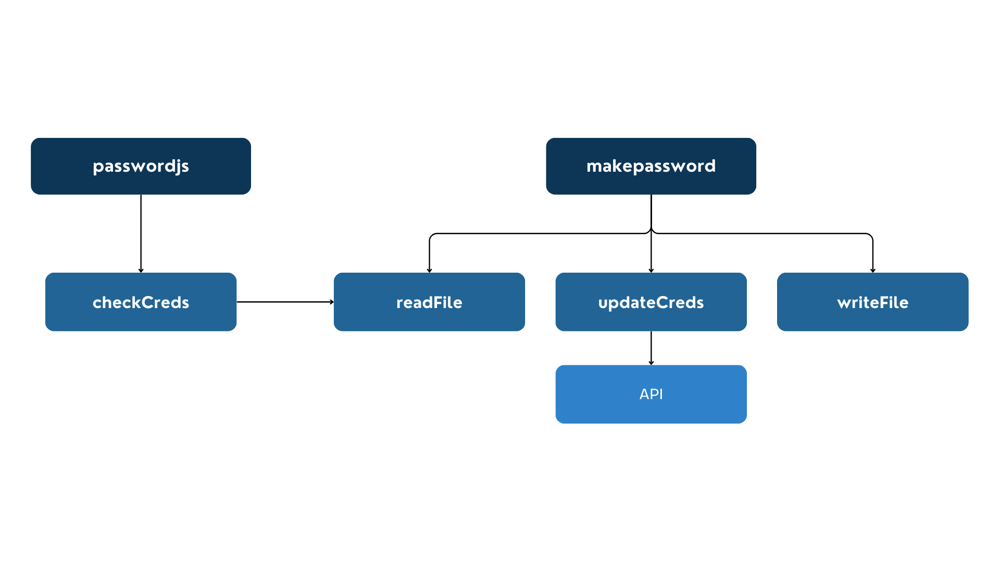

# Software Design

## Diagram

## Modules

- `makepassword()`
  - Responsibility:
    - Hashes the passwords in the provided file and saves them with their corresponding emails to an encrypted file
    - Uploads the email/hashed password parirs to MongoDB
  - Input:
    - The name of the file to retrieve the email/password pairs from
    - The name of the encrypted file that will contain the email/hashed password pairs
  - Output:
    - None
- `passwordjs()`
  - Responsibility:
    - Informs a user if the provided email and password pair is found in the provided file
  - Input:
    - N/A
    - There are no parameters for `passwordjs()`, but the function requires a file name, an email, and a password to be passed to the NodeJS Process `argv` variable
  - Output:
    - `true` if the email and password pair is found in the provided file
    - `false` if the email and password pair is not found in the provided file
- `readFile()`
  - Responsibility:
    - Reads and returns the content of a file
  - Input:
    - The name of the file to be read (may also include a relative path to the file)
  - Output:
    - `false` if the file does not exist
    - An array of strings - each string is one line of the file
- `writeFile()`
  - Responsibility:
    - Writes an array to a file
    - If the file does not already exist, it will create a file before writing to it
  - Input:
    - An array of strings to be written to the file
    - The name of the file to be written to (may also include a relative path to the file)
  - Output:
    - None
- `hash()`
  - Responsibility:
    - Creates and returns a hashed version of the input using `crypto`
  - Input:
    - The string to be hashed
  - Output:
    - A hashed version of the input
- `updateCreds()`
  - Responsibility:
    - Extracts each email/password pair from the array of provided credentials
    - Hashes passwords
    - Calls the `create-user` API to add each email/hashed password pair to the MongoDB database
    - Formats each email/hashed password pair in its own string in the format of `'email:password'`
    - Returns an array of all the formatted email/hashed password strings
  - Input:
    - An array of email/password pairs in the format of `'email:password'`
  - Output:
    - An array of email/hashed password pairs in the format of `'email:password'`
- `checkCreds()`
  - Responsibility:
    - Checks whether the provided email/password pair can be found in the provided file
  - Input:
    - The name of the file to be checked
    - The email to be checked
    - The password to be checked
  - Output:
    - `true` if the provided email was found in the file and the password matches the password that corresponds with the email in the file
    - `false` if the provided email was not found in the file
    - `false` if the password does not match the password that corresponds with the email in the file

## Rationale

- Each module keeps different functionalities separated, which simplifies the code.
- Each module has one fuctionality, which makes it reusable.
